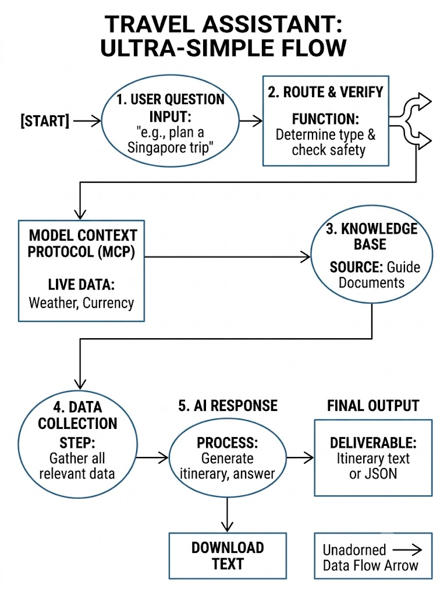

# AI Travel Planning Assistant

A context-aware travel assistant combining a modular document-based knowledge base (Retrieval-Augmented Generation) with dynamic Model Context Protocol (MCP) tool execution. The application synthesizes static travel guide knowledge with live weather forecasts and real-time currency exchange rates to create weather-adaptive, budget-tailored itineraries.

While Singapore is implemented as the reference destination, the architecture is country-agnostic and modular to support multiple international destinations.

---

## 1. Deliverables & Project Assets

* **Source Code Repository (Item 15):** [GitHub Repository](https://github.com/sidhant97/ai-travel-planner.git)
* **Working Application (Item 16):** Fully functional Streamlit interface executable locally on port `8501`.
* **Backup Source Code:** [Google Drive Link]
* **Demonstration Video (Item 20):** [Google Drive Link] *(Walkthrough showcasing pure RAG retrieval, MCP tool calling, combined context synthesis, and conversational context memory).*

---

## 2. System Architecture & RAG Workflow (Item 18)

### System Architecture



### Key Architectural Layers

* **Dual-LLM Resilience:** Default routing via **Groq** (`llama-3.1-8b-instant`) for ultra-low-latency response generation. Automatically fails over to **OpenAI** (`gpt-4o-mini`) on rate limits or API downtimes.
* **Modular Multi-Country Vector Store:** Document ingestion utilizing LangChain and **ChromaDB**. Each destination operates inside an isolated vector namespace (`data/<destination>/`), preventing cross-destination data bleeding and enabling seamless dynamic expansion (e.g., Japan, France, UAE).
* **Real-Time MCP Tool Integration:**
  * `get_weather`: Live multi-day weather forecasts, temperature ranges, and precipitation probability metrics.
  * `convert_currency`: Real-time foreign exchange conversions referencing European Central Bank daily rates.
* **Context Synthesis Engine:** Cross-references destination landmarks with real-time variables. Dynamically swaps outdoor excursions for covered/indoor alternatives whenever precipitation probability exceeds **40%**.
* **Conversation Context Memory:** Multi-turn dialogue management using a sliding conversation window, preserving user budgets, origin currency, duration, and dietary preferences across turns.
* **Domain Guardrails:** Strict input boundary validation that catches and rejects queries outside travel planning (e.g., ticket bookings, coding, general trivia).

### RAG Ingestion & QueryWorkflow

flowchart TD
    subgraph Ingestion["1. Ingestion Pipeline (Offline)"]
        A[Markdown Travel Guides<br/><code>data/&lt;destination&gt;/*.md</code>] --> B[RecursiveCharacterTextSplitter<br/><code>chunk=1000, overlap=150</code>]
        B --> C[Embedding Model<br/>HuggingFace / OpenAI]
        C --> D[(ChromaDB Namespaces<br/><code>./chroma_store/singapore</code>)]
    end

    subgraph Runtime["2. Query & Synthesis Runtime"]
        Q([User Travel Query]) --> G{Domain Guardrails}
        G -->|Valid| O[Context Synthesis Orchestrator]
        
        O <-->|Semantic Search Top-K| D
        O <-->|Live Context| T[MCP Tools]
        
        subgraph Tools["MCP Tool Execution"]
            T <--> W[Open-Meteo<br/>Live Weather]
            T <--> F[Frankfurter<br/>ECB FX Rates]
        end
        
        O --> L[LLM Engine<br/>Groq LLaMA 3.1 ──► OpenAI Failover]
        L --> Out([Grounded Weather-Adaptive Plan])
    end


---

## 3. Knowledge-Base Sources & Ingestion (Items 17 & 18)

The reference implementation uses static travel documentation stored in `data/singapore/`.

### Knowledge Sources Used

* **Wikivoyage: Singapore Travel Guide:** Transportation systems, neighborhood zones, cultural etiquette, local customs, and practical tips.
* **Visit Singapore: Essential Travel Information:** Public transit cards (EZ-Link/STP), climate advisories, local laws, fines, and connectivity.
* **Visit Singapore: Sample Itineraries & Things to Do:** Multi-day route blueprints, family-friendly activities, and major landmarks.

### Instructions for Obtaining & Adding Documents

1. Create a markdown document inside the appropriate country folder: `data/<destination_name>/` (e.g., `data/japan/tokyo_guide.md`).
2. Source text from open-access guides (such as Wikivoyage, official tourism boards, or municipal transit guides) and convert them to clean Markdown files without raw HTML tags.
3. Ingest the documents into the persistent vector database by running:
   ```bash
   python rag_engine.py


---

## 4. MCP Tools & API Specifications (Item 18)

Both integrated tools require no API keys and operate using the Model Context Protocol pattern:

### 1. Weather Forecast Service: Open-Meteo

* **Base Endpoint:** `https://api.open-meteo.com/v1/forecast`
* **Method:** `GET`
* **Authentication:** None required
* **Sample Request:**
http
GET [https://api.open-meteo.com/v1/forecast?latitude=1.3521&longitude=103.8198&daily=weather_code,temperature_2m_max,temperature_2m_min,precipitation_probability_max&timezone=Asia/Singapore](https://api.open-meteo.com/v1/forecast?latitude=1.3521&longitude=103.8198&daily=weather_code,temperature_2m_max,temperature_2m_min,precipitation_probability_max&timezone=Asia/Singapore)


* **Payload Output:** Maximum and minimum daily temperatures, precipitation probability metrics, and weather condition codes used to dynamically trigger indoor alternatives.

### 2. Foreign Exchange Service: Frankfurter

* **Base Endpoint:** `https://api.frankfurter.app/latest`
* **Method:** `GET`
* **Authentication:** None required (European Central Bank reference data)
* **Sample Request:**
http
GET [https://api.frankfurter.app/latest?amount=60000&from=INR&to=SGD](https://api.frankfurter.app/latest?amount=60000&from=INR&to=SGD)


* **Payload Output:** Real-time exchange rates and converted currency totals used to establish localized traveler spending limits.

---

## 5. Prompt Engineering & Context Strategy (Item 18)

* **Strict Grounding & Zero-Hallucination:** The model is strictly instructed to draw destination facts exclusively from retrieved chunks. If the vector store lacks the requested information, the model explicitly states that the information is unavailable rather than fabricating recommendations.
* **Tool-RAG Boundary Enforcement:** Static domain knowledge (attractions, culture, neighborhoods) must come from RAG retrieval. Dynamic, time-sensitive metrics (weather, currency rates) must strictly trigger MCP tools.
* **Explicit Provenance Attribution:** Every response attributes its data points to their origin using standardized inline source tags:
* `[Knowledge Base]`: Facts retrieved from stored documents.
* `[Live MCP Tool]`: Real-time weather and foreign exchange figures.
* `[Assistant Reasoning]`: Routing logic, itinerary schedules, and synthesis.


* **Conditional Logic Execution:** If precipitation probability is greater than 40%, the model executes conditional planning logic, automatically proposing indoor alternatives (museums, covered conservatories, shopping malls) in place of open-air spots.
* **State & Memory Management:** User budget limits, dietary preferences, and previously mentioned trip parameters are carried forward across dialogue turns using an in-memory session buffer.

---

## 6. Setup & Execution Instructions (Item 18)

### Prerequisites

* Python 3.10 or higher
* Groq API Key and/or OpenAI API Key

### Step 1: Clone the Repository

```bash
git clone [https://github.com/sidhant97/ai-travel-planner.git](https://github.com/sidhant97/ai-travel-planner.git)
cd ai-travel-planner

```

### Step 2: Set Up Virtual Environment

**macOS / Linux:**

```bash
python3 -m venv venv
source venv/bin/activate

```

**Windows (PowerShell):**

```powershell
python -m venv venv
.\venv\Scripts\Activate.ps1

```

### Step 3: Install Dependencies

```bash
pip install -r requirements.txt

```

### Step 4: Configure Environment Variables

Create a `.env` file in the project root:

```ini
# LLM Provider Configuration
GROQ_API_KEY=gsk_your_groq_api_key_here
GROQ_MODEL=llama-3.1-8b-instant
OPENAI_API_KEY=sk-proj-your_openai_api_key_here
OPENAI_MODEL=gpt-4o-mini

```

### Step 5: Ingest Knowledge Base

Populate the ChromaDB vector database with the document chunks:

```bash
python rag_engine.py

```

### Step 6: Launch the Application

Run the Streamlit web interface:

```bash
streamlit run app.py

```

Open your browser and navigate to `http://localhost:8501`.

### Step 7: Run Automated Verification Tests

Run the automated test suite covering tool execution, RAG search, and fallback handlers:

```bash
python test_suite.py

```

---

## 7. Sample Questions & Application Responses (Item 19)

### Scenario 1: Pure Knowledge Base Retrieval (RAG)

* **User Question:** *"What cultural etiquette rules and public transit guidelines should I follow in Singapore?"*
* **Executed Components:** ChromaDB semantic retrieval (`data/singapore/`)
* **Application Response:**
* **Public Transit Guidelines [Knowledge Base]:** Eating, drinking, and smoking are strictly forbidden on all MRT trains and in stations, carrying fines up to SGD 500. Travel fares can be paid via contactless bank cards, mobile wallets, or an EZ-Link card.
* **Cultural Etiquette [Knowledge Base]:** Always remove your shoes before entering temples, mosques, or private residences. Tipping is not customary in Singapore, as a 10% service charge is already added to bills at most restaurants.


### Scenario 2: Pure MCP Tool Execution (Currency & Weather)

* **User Question:** *"Convert 50,000 INR to SGD and tell me the weather forecast for Singapore tomorrow."*
* **Executed Components:** `convert_currency` (Frankfurter API) + `get_weather` (Open-Meteo API)
* **Application Response:**
* **Currency Conversion [Live MCP Tool]:** Input: 50,000 INR | Converted: ~787.00 SGD | Rate: 1 INR = 0.01574 SGD (ECB Reference Data).
* **Weather Forecast for Tomorrow [Live MCP Tool]:** Temperature: Min 26.2°C / Max 31.8°C | Precipitation Probability: 70% (High risk of rain/thunderstorms).


### Scenario 3: Combined Response (RAG + Weather + FX + Synthesis)

* **User Question:** *"Plan a 1-day itinerary for Singapore on an INR 20,000 budget. Include outdoor sights, but adjust with indoor alternatives if rain is expected."*
* **Executed Components:** `convert_currency` + `get_weather` + ChromaDB Retrieval + Groq Synthesis
* **Application Response:**
* **Budget Conversion [Live MCP Tool]:** INR 20,000 converts to SGD 314.80 for day expenses.
* **Weather Forecast [Live MCP Tool]:** High: 31°C, Low: 26°C | Precipitation Probability: 65% (Rain Expected).
* **Weather-Adaptive Itinerary [Knowledge Base & Assistant Reasoning]:**
* *Morning (Outdoor Plan):* Gardens by the Bay outdoor grounds.
* *Rain Backup Triggered (65% Rain Risk):* Move inside the climate-controlled Flower Dome and Cloud Forest conservatories [Knowledge Base].
* *Lunch:* Maxwell Food Centre [Knowledge Base]. Try Hainanese Chicken Rice (~SGD 6–8) [Assistant Reasoning].
* *Afternoon (Outdoor Plan):* Walking tour through Chinatown and Marina Bay waterfront.
* *Rain Backup Triggered:* Explore the National Gallery Singapore or the Jewel Changi indoor canopy to remain sheltered [Knowledge Base].
* *Evening:* Dinner and covered observation deck visit at Marina Bay Sands [Knowledge Base].


### Scenario 4: Conversational Context & Multi-Turn Memory

* **User Question (Follow-Up):** *"Can you adjust the schedule above to focus entirely on kid-friendly spots, while keeping the same budget?"*
* **Executed Components:** Conversation Context Memory + ChromaDB Retrieval + Groq Synthesis
* **Application Response:**
* **Preserved Context [Assistant Reasoning]:** Allocated Budget: SGD 314.80 (~INR 20,000) | Rain Contingency Active: Yes (65% precipitation probability preserved).
* **Updated Family-Friendly Schedule [Knowledge Base]:**
* *Morning:* Jacob Ballas Children's Garden (interactive nature play areas with covered rest shelters).
* *Afternoon (Rain Contingency):* S.E.A. Aquarium at Resorts World Sentosa (fully indoor marine exhibits suitable for all ages).
* *Evening:* Lau Pa Sat Satay Street for dinner, utilizing the sheltered open-air dining pavilions.


### Scenario 5: Guardrail Rejection (Out-of-Scope)

* **User Question:** *"Can you book a flight ticket from New Delhi to Singapore for next Friday?"*
* **Executed Components:** `guardrails.py` Domain Validation
* **Application Response:**
> "I cannot book flights or process payment transactions. My capabilities are focused on travel destination research, weather-adaptive itinerary synthesis, and budget currency conversions. Please use an airline booking portal or travel agency for ticket purchases."


---

## 8. Project Directory Structure

```plaintext
ai-travel-planner/
├── data/
│   ├── singapore/                 # Default destination knowledge base
│   │   ├── visit_singapore_itineraries.md
│   │   ├── visit_singapore_practical.md
│   │   └── wikivoyage_singapore.md
│   └── japan/                     # Modular country extension example
│       └── tokyo_travel_guide.md
├── chroma_store/                  # Persistent local Chroma vector database
├── .env                           # Environment keys and runtime configs
├── .gitignore                     # Exclusions (venv, .env, chroma_store)
├── app.py                         # Streamlit UI with chat interface and TXT export
├── guardrails.py                  # Input validation and domain boundaries
├── mcp_client.py                  # Client interface for tool execution
├── mcp_server.py                  # MCP tool definitions (Open-Meteo & Frankfurter)
├── orchestrator.py                # Multi-provider agent brain, routing, and fallback
├── prompts.py                     # Prompt engineering templates and synthesis rules
├── rag_engine.py                  # LangChain chunking and vector store ingestion
├── requirements.txt               # Python dependencies
├── test_suite.py                  # Automated test suite
└── README.md                      # Project documentation

```

---

## 9. Future Scope & Roadmap

* **Expanded LLM Provider Integration:** Integrate Anthropic Claude 3.5 Sonnet for deeper reasoning and long-context itinerary structuring.
* **Dynamic Cloud Vector Stores:** Migrate local ChromaDB persistence to managed solutions like Pinecone, AWS OpenSearch, or pgvector, paired with an S3 ingestion pipeline.
* **Containerized Deployment:** Package the service with Docker and deploy via Kubernetes with auto-scaling to handle high concurrency.
* **Additional Travel MCP Tools:** Add Google Maps / Transit APIs for route calculation and web-scraping tools for flight/hotel estimations.

---

## 10. Developer Profile

* **Developer Name:** Sidhant Gupta
* **Email:** guptasidhant1997@gmail.com
* **Contact Number:** +91-9996764596

```

```